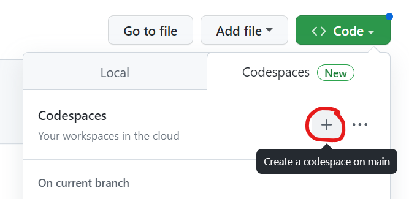

# Onware Developer Candidate Challenge

If you're seeing this, you've completed the first step - creating
your own copy of the repository! 🎉

When you're ready to start working on the challenge, click on the 
green code button towards the top left of this area, click the 
codespaces tab, and click the plus symbol button as shown below.
Additional instructions will be available in the codespace.

